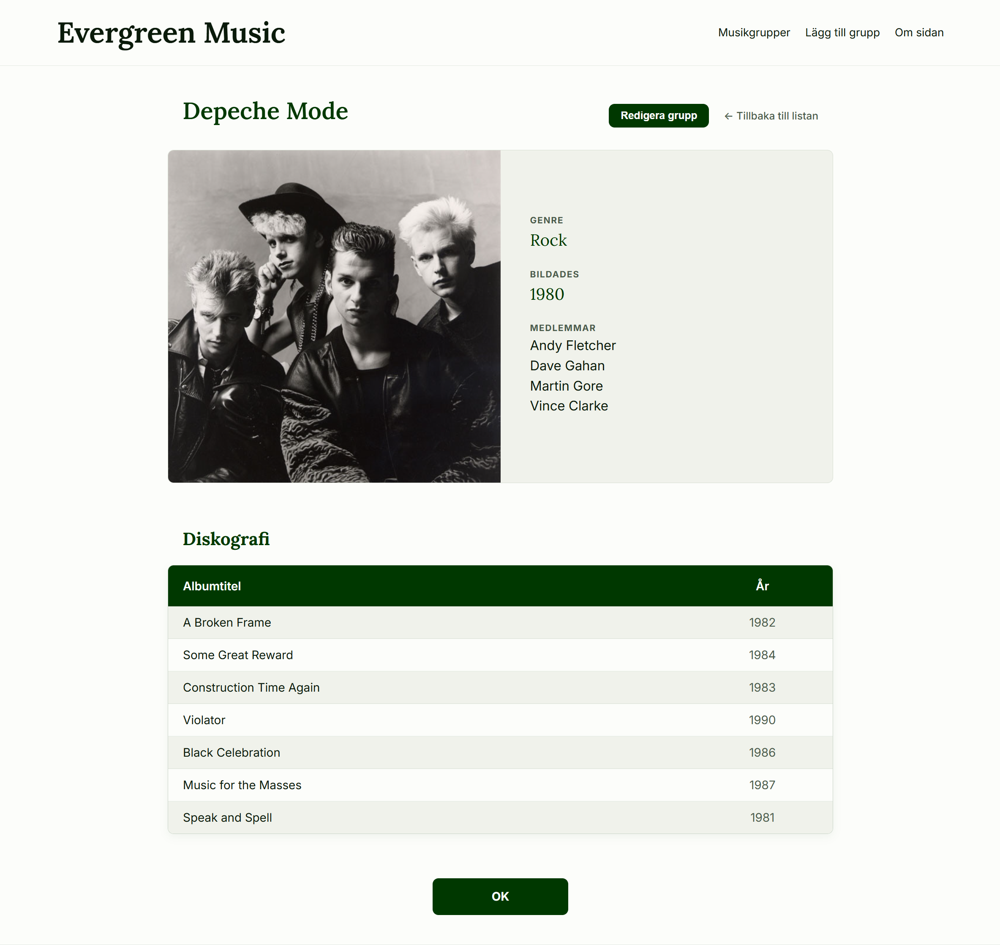

# Evergreen Music
### *A School Project in Frontend/JavaScript*

**Author:** Stefan Brodin  
**Repository:** [https://github.com/StefanBrodin/Evergreen-Music](https://github.com/StefanBrodin/Evergreen-Music)

---

## Project Overview
Evergreen Music is a web application developed as part of the Frontend Development course at **Teknikhögskolan Gävle**. What started as a static HTML/CSS assignment has evolved into a dynamic **Single Page Application (SPA)** interface that interacts with a live REST API.

The project focuses on clean, modular code, modern CSS layouts, and robust asynchronous JavaScript logic.

## Technical Highlights

### 1. API Integration & CRUD
The application features full **CRUD** functionality. It uses a Service to communicate with an external REST API to manage music groups, artists, and albums using:
* **Asynchronous JavaScript:** Extensive use of `fetch` and `async/await`.
* **Service-based Architecture:** Data logic is encapsulated in a dedicated `MusicGroupService` class.

### 2. Intelligent Pagination & UX
The pagination system uses a **Sliding Window** algorithm. This ensures that the active page remains centered in the navigation bar, providing context even when dealing with large datasets.

### 3. Stability & Performance (CLS)
By implementing "Empty Row" logic in the list views, the application maintains a consistent height (10 rows). This effectively prevents **Cumulative Layout Shift (CLS)**, ensuring that the layout never "jumps" during navigation.

### 4. Robust Error Handling
To ensure a reliable application, all API interactions are wrapped in try/catch blocks. The system provides clear feedback to the user if an operation fails, preventing silent errors and improving the overall reliability of the interface.

## Technical Highlights

* **Logic:** Modern ES6+ JavaScript Modules.
* **Layout:** Responsive design using CSS Grid and Flexbox.
* **Typography:** Variable fonts (Lora for headings, Inter for UI) for optimal performance.
* **Styling:** Modern CSS using Variables for easy theming (Dark Mode ready).
* **Architecture:** Adheres to Atomic Design Principles for a structured and scalable UI.

---
*Note: Since the project uses JavaScript Modules, it is recommended to run it through a local server (like Live Server in VS Code)*